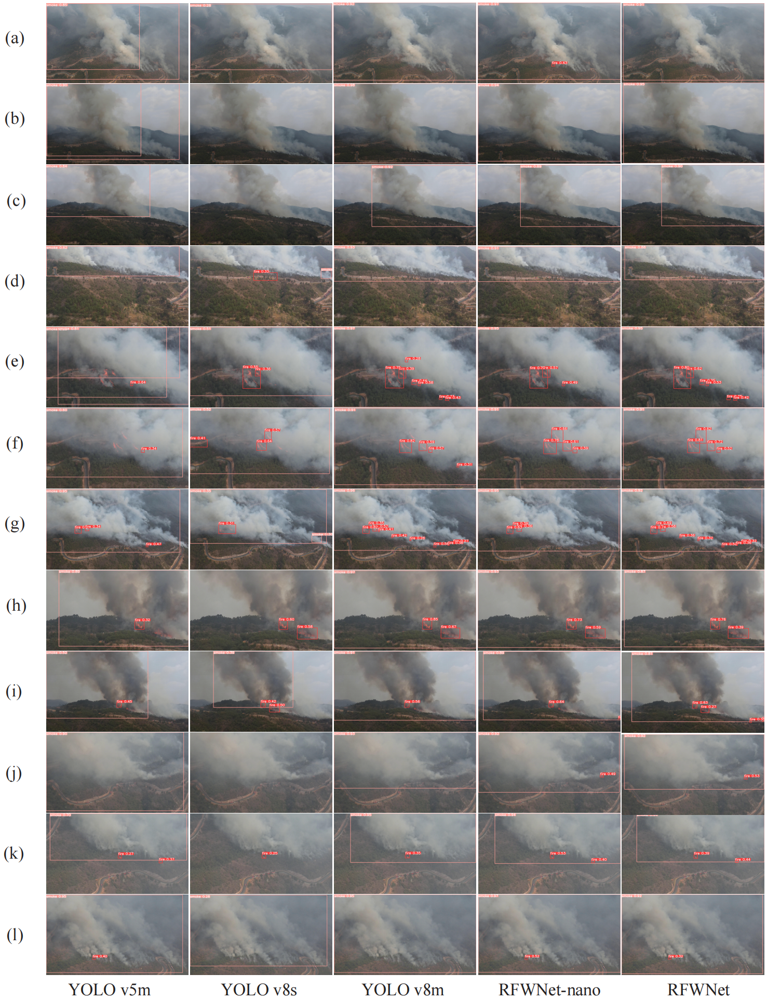

# Yuxi Wildfire Dataset 🌲🔥

The Yuxi wildfire dataset is a meticulously curated collection of remote sensing images captured during a forest wildfire in the Jiangchuan District of Yuxi City, Yunnan Province, China. This dataset is the outcome of rigorous efforts by our research team to provide the community with high-definition images that can advance the field of wildfire detection and analysis through remote sensing techniques.

## Dataset Overview


- **Date of Collection**: April 11, 2023
- **Location**: Jiangchuan District, Yuxi City, Yunnan Province, China (Longitude: 102.70875, Latitude: 24.42576)
- **Equipment Used**: DJI Mavic Air 2 drone
- **Resolution**: 3840×2160 (Ultra-HD)
- **Total Images**: 876
- **Bounding Boxes**: 4,423 (Pixel-level annotated)
- **Training Set**: 625 images with 3,184 bounding boxes (~5.1 bounding boxes/image)
- **Validation Set**: 251 images with 1,239 bounding boxes (~4.9 bounding boxes/image)

## Research Work

Our team acted promptly during the forest wildfire incident in Jiangchuan District to capture 14 high-definition videos at 60FPS using a DJI Mavic Air 2 drone. From these recordings, 876 ultra-HD remote sensing images were derived. Each image was then carefully annotated at the pixel level, resulting in a total of 4,423 bounding boxes. The dataset provides insights into the spatial distribution of flames and smoke, with flames generally occupying smaller dimensions and smoke extending to larger areas.

The detailed statistical analysis and heatmap for bounding box dimensions can be referred to in our research paper.



## Download Links

To facilitate diverse research requirements, we've made the annotated data available in formats suitable for different object detection frameworks:

### Google Drive

- YOLO Format(yolov5; yolov8):
- YOLO Format(Darknet):
- COCO Format:
- COCO Format(mmdetection): [https://drive.google.com/file/d/1p72WvTa-WE6Kgjv6xVQU6Y-ZwG9JFe5V/view?usp=sharing](https://drive.google.com/file/d/1p72WvTa-WE6Kgjv6xVQU6Y-ZwG9JFe5V/view?usp=sharing)
- Pascal VOC Format:

### Baidu Drive

- YOLO Format(yolov5; yolov8): 链接：[https://pan.baidu.com/s/1dRm_FBui-Z72N_-voOqmvQ?pwd=sunx](https://pan.baidu.com/s/1dRm_FBui-Z72N_-voOqmvQ?pwd=sunx) 提取码：sunx
- YOLO Format(Darknet): 链接：[https://pan.baidu.com/s/1v_CpLEk9svs5C0n4VOIAyQ?pwd=dr9b](https://pan.baidu.com/s/1v_CpLEk9svs5C0n4VOIAyQ?pwd=dr9b) 提取码：dr9b
- COCO Format: 链接：[https://pan.baidu.com/s/1vERdr6L19CJ26bzAMo8odg?pwd=tf9y](https://pan.baidu.com/s/1vERdr6L19CJ26bzAMo8odg?pwd=tf9y) 提取码：tf9y
- COCO Format(mmdetection): 链接：[https://pan.baidu.com/s/1MqJKK18CI9PLvK0VMC8k4Q?pwd=s0z0](https://pan.baidu.com/s/1MqJKK18CI9PLvK0VMC8k4Q?pwd=s0z0) 提取码：s0z0
- Pascal VOC Format: 链接：[https://pan.baidu.com/s/1O0ijehHvjOHVuL1f215p3g?pwd=bflz](https://pan.baidu.com/s/1O0ijehHvjOHVuL1f215p3g?pwd=bflz) 提取码：bflz

## Usage and Licensing

This dataset is made available for academic research purposes. Any commercial use or redistribution without permission is prohibited. If you utilize this dataset in your research, please cite our work.

```bibtex
@article{RFWNetWang2023,
    title={RFWNet: A Multi-scale Remote Sensing Forest Wildfire Detection Network with Digital Twinning, Adaptive Spatial 
Aggregation, and Dynamic Sparse Features},
    author={Guanbo Wang, Haiyan Li, Shuhua Ye, Hongzhi Zhao, Hongwei Ding, Shidong Xie,},
    journal={IEEE Transactions on Geoscience and Remote Sensing(Under Review))},
    year={2023}
}

```
